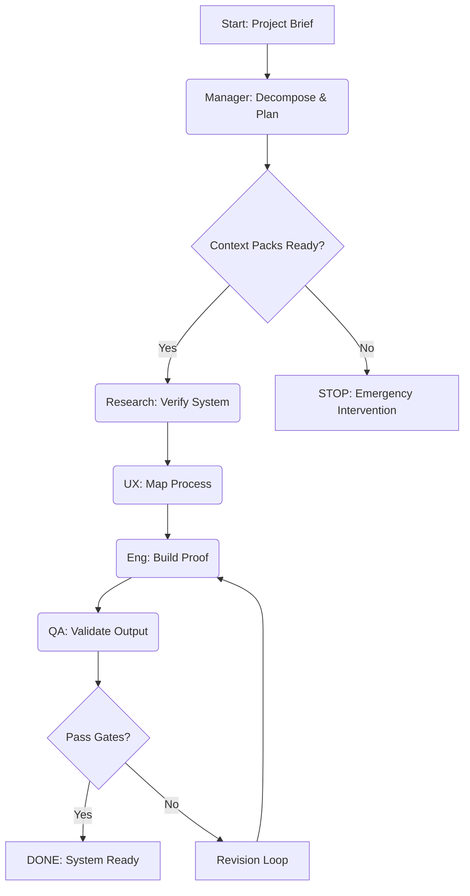

# UX FLOW: Agency Validation Process
**ID:** UX001
**Date:** 2026-01-25
**Agent:** UX Architecture

## Flow Diagram

## Description
The user journey for this validation project is a linear "Pass the Baton" flow.
Each agent verifies the previous agent's output before starting.
- **Entry Point:** Manager Plan (D001)
- **Critical Interaction:** The Handoff in the Ledger.
- **Success State:** A passed QA Report.
